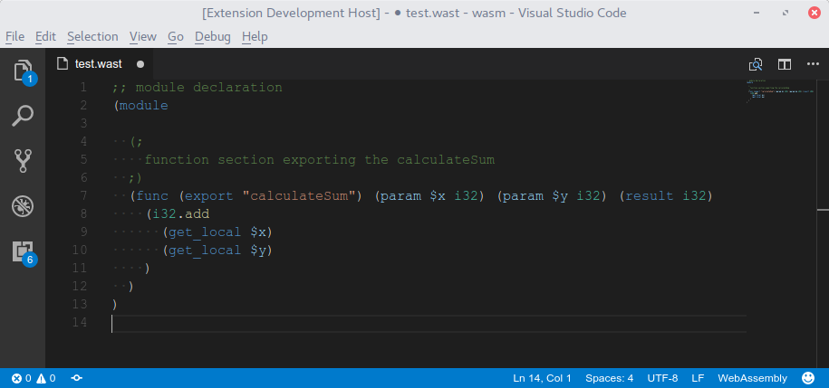
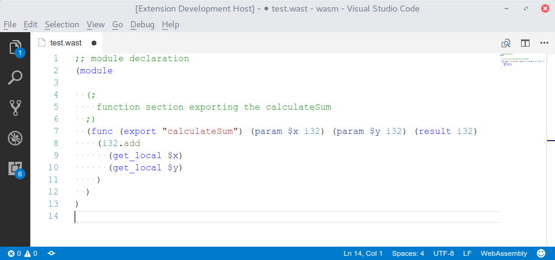

# WebAssembly Syntax Highlight

Syntax highlight for WebAssembly textual representation.

## Features

Simple syntax highlight for WebAssembly textual representation.

Dark theme:

Light theme:

## Known Issues

No monsters has shown their faces. Let me know if some bug bite you!

## Release Notes

### 1.0.0

Initial release
